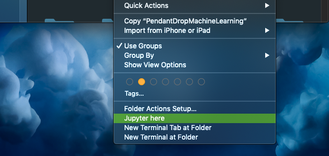

# JupyterApp-mac
This repository is not affiliated with Project Jupyter.
This app is a simple standalone application that can run jupyter servers and has some "ease-of-use" features.
If you find bugs (which is very likely) please tell me in the [Issues](https://github.com/FelixKratz/JupyterApp-mac/issues)

## Prerequisites
To install jupyter please follow the guide on https://jupyter.org/install

## Functionalities
Finder Integration: Use the finder to start a new jupyter server:  
  
Tabbed View and Multi Window Support  
  
Monitor the Console Output of the Server:  
  
Hotkeys:  
  
Settings:  
  
