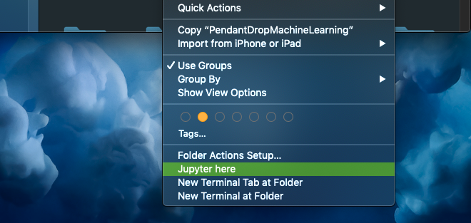
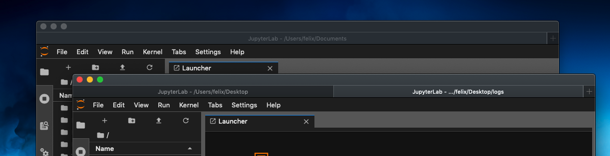
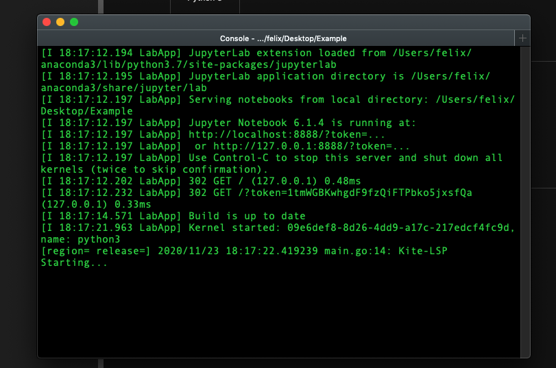
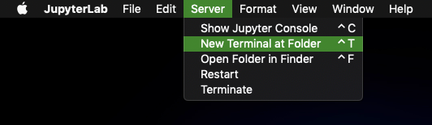
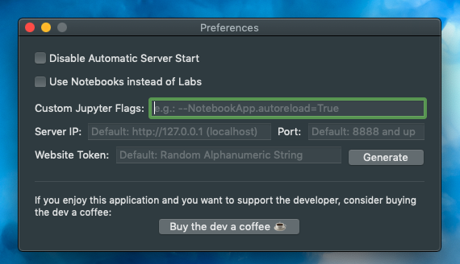

# JupyterApp-mac
This app is a simple standalone application that can run jupyter servers and has some "ease-of-use" features.
If you find bugs (which is very likely) please tell me in the [Issues](https://github.com/FelixKratz/JupyterApp-mac/issues).

## Prerequisites
To install jupyter please follow the guide on https://jupyter.org/install.
For this application to work jupyter must be accessible in a default interactive login shell 
(you can test this by opening a fresh terminal and typing: jupyter --version, you should get a list of components and versions).

## Functionalities
### Finder Integration: Use the finder to start a new jupyter server:  
  
If used on a folder this will, by default, open a new jupyter lab server with its root at the folder path.
If used on a file this will, by default, open a server with its root at the folder in which the file is located.  
The default behaviour can be customized in the Preferences to open a jupyter notebook server instead.    

### Tabbed View and Multi Window Support  
  
The tab bar can be toggled via the "View" menu in the status bar.  
When the application is clicked, no window will open. To open a new jupyter server simply go to "File"->"New" and pick the
root folder for the server. Alternatively you can also use the shortcut command-N to create a new window/tab.  
It is possible to use the familiar tabbing system found in Finder or Safari, where a tab can be dragged away from its containing window to
create a new window or recombine two windows to a single tabbed window.    

### Monitor the Console Output of the Server:  
  
The console output can be used to monitor what the server is doing, which can be helpful to check the status of extension (e.g. Kite) or Packages (e.g. Tensorflow) An individual tabbed console window can be opened for every running server by bringing the jupyter window to front and going to "Server"->"Show Jupyter Console"    
### Hotkeys:  
  
You can the hotkeys to open a new Terminal window at the root project folder and to open the project folder in a new Finder window (which can be helpful if you want to quickly check something)    
### Settings:  
  
The settings allow you to change some default behaviour to your liking.  
* Disabling the automatic start of jupyter servers altogether (essentially turning this app into a clunky web browser)
* Using jupyter notebooks instead of jupyter labs, as some people prefer notebooks over labs
* Adding custom jupyter startup flags for a full list of flags run: jupyter lab --help-all  
 The flags "--port, --port-retries, --NotebookApp.token, --NotebookApp.open_browser and --NotebookApp.notebook_dir" are always set by the system to
 handle invoking a new server and setting up the token, port, directory, etc. so those should not be specified there.
* Server IP: Only change if you want to browse to non-local server and automatic server start is disabled (I guess)
* Port: This port will be the *initial* port used for the servers, where the port of additional servers is monotonicaly increasing
* Website Token: If you want to access the server with a different browser, or device, you need the token. By default the token is a 30 character random alphanumeric string (probably not cryptosafe, so don't use for nuclear missle code storage). You can also choose to generate a static alphanumeric string, which will then always be the same for any further servers.    

To save the settings, hit enter in the textfields!    
